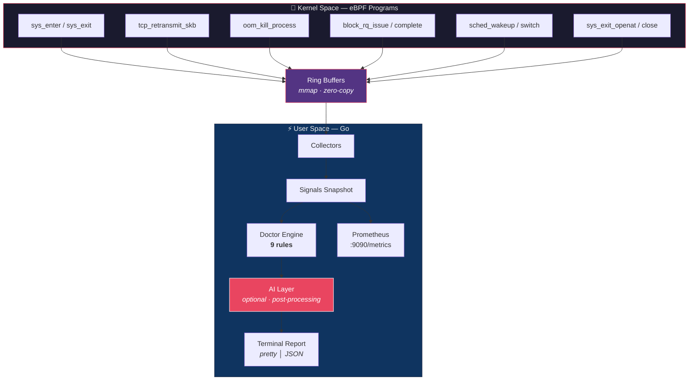

<p align="center">
  <h1 align="center">KERNO</h1>
  <p align="center">
    <strong>eBPF-based kernel observability engine for Linux</strong>
  </p>
  <p align="center">
    <a href="https://github.com/lowplane/kerno/actions/workflows/ci.yml"></a>
    <a href="https://goreportcard.com/report/github.com/lowplane/kerno"></a>
    <a href="LICENSE"></a>
    <a href="https://github.com/lowplane/kerno/releases"></a>
    
  </p>
</p>

---

Kerno traces **syscall latency**, **TCP flows**, **OOM events**, **disk I/O**, **scheduler delays**, and **file descriptor leaks** in real-time using eBPF — then tells you exactly what's wrong in plain English.

One command. 30 seconds. Zero configuration.

```bash
sudo kerno doctor
```

```
╔═══════════════════════════════════════════════════════════╗
║                     KERNO DOCTOR                         ║
║          Kernel Diagnostic Report                        ║
╚═══════════════════════════════════════════════════════════╝

Host:     prod-db-01
Kernel:   6.8.0-generic

────────────────────────────────────────────────────────────
 FINDINGS  (2 critical · 1 warning · 0 info)
────────────────────────────────────────────────────────────

 !!  CRITICAL  TCP Retransmit Storm
     ──────────────────────────────
     Signal:   retransmit rate=12.3% (threshold: 2.0%), 847 retransmits
     Cause:    Network path degradation causing excessive retransmissions
     Impact:   Every connection risks latency spikes
     Fix:      → ethtool -S eth0 | grep -i error
               → ping -c 100 <gateway>

 !!  CRITICAL  Disk I/O Bottleneck Detected
     ─────────────────────────────────────
     Signal:   sync P99=280ms (threshold: 200ms), 3,241 sync ops
     Cause:    Storage device is saturated — fsync operations are blocking
     Impact:   Database writes and file syncs are delayed
     Fix:      → iostat -x 1 5
               → Consider faster storage or write batching

 !   WARNING   CPU Scheduler Contention
     ──────────────────────────────────
     Signal:   runqueue P99=18ms (warning: 5ms)
     Cause:    Processes waiting in the CPU run queue longer than expected
     Fix:      → top -H
               → Reduce worker threads or increase CPU count

────────────────────────────────────────────────────────────
 RECOMMENDED ACTION ORDER
────────────────────────────────────────────────────────────

  1. [NOW]     TCP Retransmit Storm
  2. [NOW]     Disk I/O Bottleneck Detected
  3. [5 MIN]   CPU Scheduler Contention

════════════════════════════════════════════════════════════
```

## Why Kerno

Every observability tool you use lives at the **application layer**. The kernel sees problems **first** — elevated syscall latency, TCP retransmits, memory pressure — minutes before your APM dashboard.

Kerno is the **missing layer**:

| | Layer | K8s Required | SLO Mapping | AI Analysis |
|---|---|:---:|:---:|:---:|
| Prometheus | Application | No | No | No |
| Datadog APM | Application | No | Partial | Yes |
| Inspektor Gadget | Container | **Yes** | No | No |
| **Kerno** | **Kernel** | **No** | **Yes** | **Yes** |

## Features

| Feature | Status | Description |
|---|:---:|---|
| `kerno doctor` | ✅ | 30-second automated kernel diagnostic with ranked findings |
| `kerno explain` | ✅ | AI-powered kernel error explanation (no root needed) |
| `kerno predict` | 🚧 | Predict failures before they happen via trend analysis |
| Syscall latency tracing | 🚧 | Per-syscall p50/p95/p99 via eBPF |
| TCP flow monitoring | 🚧 | Retransmits, RTT, connection lifecycle |
| OOM kill tracking | 🚧 | Pre-kill alerts with full process context |
| Disk I/O latency | 🚧 | Block I/O per-operation percentiles |
| Scheduler delay | 🚧 | CPU run queue latency (runqlat) |
| FD leak detection | 🚧 | Open/close delta tracking per process |
| AI-powered analysis | ✅ | Cross-signal correlation via Anthropic, OpenAI, or Ollama |
| Prometheus export | 📋 | `/metrics` endpoint with 14 kernel metrics |
| Web dashboard | 📋 | Real-time kernel signal visualization |
| SLO bridge | 📋 | Map kernel signals to error budgets |
| Kubernetes enrichment | 📋 | Pod/namespace/node context for all signals |

**Legend:** ✅ Done | 🚧 In Progress | 📋 Planned

## Quick Start

### Prerequisites

- Linux kernel ≥ 5.8 with BTF support (`ls /sys/kernel/btf/vmlinux`)
- Root privileges (or `CAP_BPF` + `CAP_PERFMON`)

### Install

```bash
# From source
git clone https://github.com/lowplane/kerno.git
cd kerno
make build
sudo ./bin/kerno doctor

# Docker
docker run --privileged --pid=host \
  ghcr.io/lowplane/kerno:latest doctor
```

### Usage

```bash
# 30-second kernel diagnostic
sudo kerno doctor

# Quick 10-second check
sudo kerno doctor --duration 10s

# JSON output for CI/CD (exits 1 on critical findings)
sudo kerno doctor --output json --exit-code

# Continuous monitoring
sudo kerno doctor --continuous --interval 60s

# AI-powered analysis (requires KERNO_AI_API_KEY)
sudo kerno doctor --ai

# Explain a kernel error — no root needed
kerno explain "BUG: kernel NULL pointer dereference, address: 0000000000000040"

# Explain from dmesg
dmesg | tail -5 | kerno explain

# Predict upcoming failures
sudo kerno predict --snapshots 5 --interval 15s

# Start as daemon with Prometheus metrics
sudo kerno start
```

## How It Works



Kerno uses **6 eBPF programs** attached to stable kernel tracepoints. Events flow through ring buffers to Go userspace, where they are aggregated into percentile distributions and analyzed by **9 diagnostic rules**. An optional **AI layer** enriches findings with cross-signal correlation and root cause analysis.

### AI Integration

AI sits **after** the deterministic rule engine — it enriches, never replaces:

- **3 providers:** Anthropic Claude, OpenAI, Ollama (local/air-gapped)
- **Privacy modes:** `full`, `redacted`, `summary` (default — only aggregates sent to LLM)
- **No LLM SDKs** — all providers use raw `net/http`
- **Graceful degradation** — AI failures are non-fatal, rule engine always works
- **Rate limiting + caching** — prevent excessive API calls in continuous mode

```bash
# Configure AI
export KERNO_AI_API_KEY="sk-..."
export KERNO_AI_PROVIDER="anthropic"  # or "openai" or "ollama"

sudo kerno doctor --ai
```

## Diagnostic Rules

| # | Rule | Trigger | Severity |
|---|------|---------|----------|
| 1 | Disk I/O Bottleneck | fsync P99 > 50ms or write P99 > 200ms | WARNING / CRITICAL |
| 2 | OOM Kill Occurred | Any OOM event in window | CRITICAL |
| 3 | TCP Retransmit Storm | Retransmit rate > 2% | CRITICAL |
| 4 | TCP RTT Degradation | RTT P99 > 10ms | WARNING |
| 5 | Scheduler Contention | Runqueue delay P99 > 5ms | WARNING / CRITICAL |
| 6 | FD Leak | FD growth > 10/sec sustained | WARNING (with ETA) |
| 7 | Syscall Latency High | Any syscall P99 > 100ms | WARNING / CRITICAL |
| 8 | OOM Imminent | Memory > 90% + positive growth | WARNING / CRITICAL (with ETA) |
| 9 | Syscall Error Rate | Error rate > 1% per syscall | WARNING / CRITICAL |

## Configuration

Zero config required. For custom setups:

```yaml
# /etc/kerno/config.yaml
log_level: info
log_format: text

collectors:
  syscall_latency: true
  tcp_monitor: true
  oom_track: true
  disk_io: true
  sched_delay: true
  fd_track: true

doctor:
  duration: 30s
  thresholds:
    syscall_p99_warning_ns: 100000000   # 100ms
    syscall_p99_critical_ns: 500000000  # 500ms
    tcp_retransmit_pct: 2.0             # 2%
    oom_memory_pct: 90.0                # 90%
    disk_p99_warning_ns: 50000000       # 50ms
    disk_p99_critical_ns: 200000000     # 200ms
    sched_delay_warning_ns: 5000000     # 5ms
    sched_delay_critical_ns: 20000000   # 20ms
    fd_growth_per_sec: 10.0

ai:
  enabled: false
  provider: anthropic       # anthropic, openai, ollama
  privacy_mode: summary     # full, redacted, summary
  cache_ttl: 5m
  rate_limit_per_minute: 10
```

Environment variables override config: `KERNO_LOG_LEVEL=debug`, `KERNO_AI_API_KEY=sk-...`, etc.

## Building from Source

```bash
# Requirements: Go 1.25+
# Optional for eBPF: clang 14+, libbpf-dev, llvm

# Build (uses stub BPF — works without clang)
make build

# Full build with eBPF compilation
make build-ebpf

# Run tests
make test

# Run linter
make lint

# All quality checks (vet + test + lint)
make check

# Build Docker image
make docker
```

## Project Structure

```
kerno/
├── cmd/kerno/           # Binary entry point
├── internal/
│   ├── ai/              # LLM provider abstraction (3 backends)
│   ├── bpf/             # eBPF loaders + Go event types
│   │   └── c/           # eBPF C programs + headers
│   ├── cli/             # Cobra CLI commands
│   ├── collector/       # Signal collection + aggregation
│   ├── config/          # Typed configuration (Viper)
│   ├── doctor/          # Diagnostic engine (rules + renderers)
│   └── version/         # Build metadata
├── Makefile             # Build orchestration
├── Dockerfile           # Multi-stage container build
├── .goreleaser.yml      # Release automation
└── CLAUDE.md            # AI assistant development guide
```

## Contributing

Contributions welcome! See [CONTRIBUTING.md](CONTRIBUTING.md) for:

- Development setup and prerequisites
- Commit message conventions (Conventional Commits)
- Code review process
- DCO sign-off requirement

## Security

For vulnerability reports, see [SECURITY.md](SECURITY.md).

## License

Apache License 2.0 — see [LICENSE](LICENSE).

---

**Kerno** is built by [Shivam Kumar](https://github.com/btwshivam) at [Lowplane](https://github.com/lowplane).
