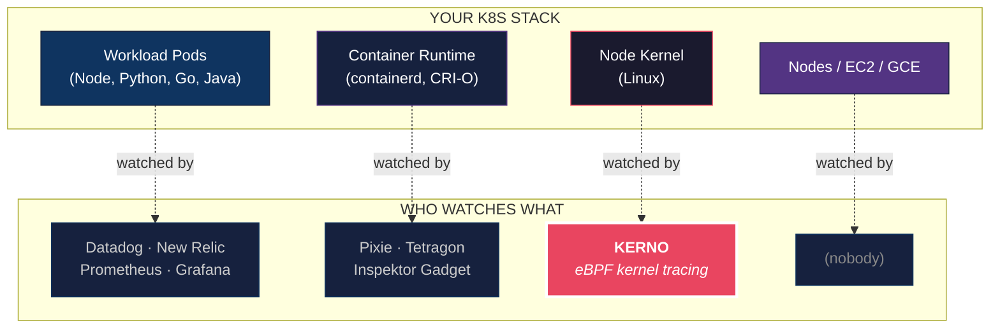
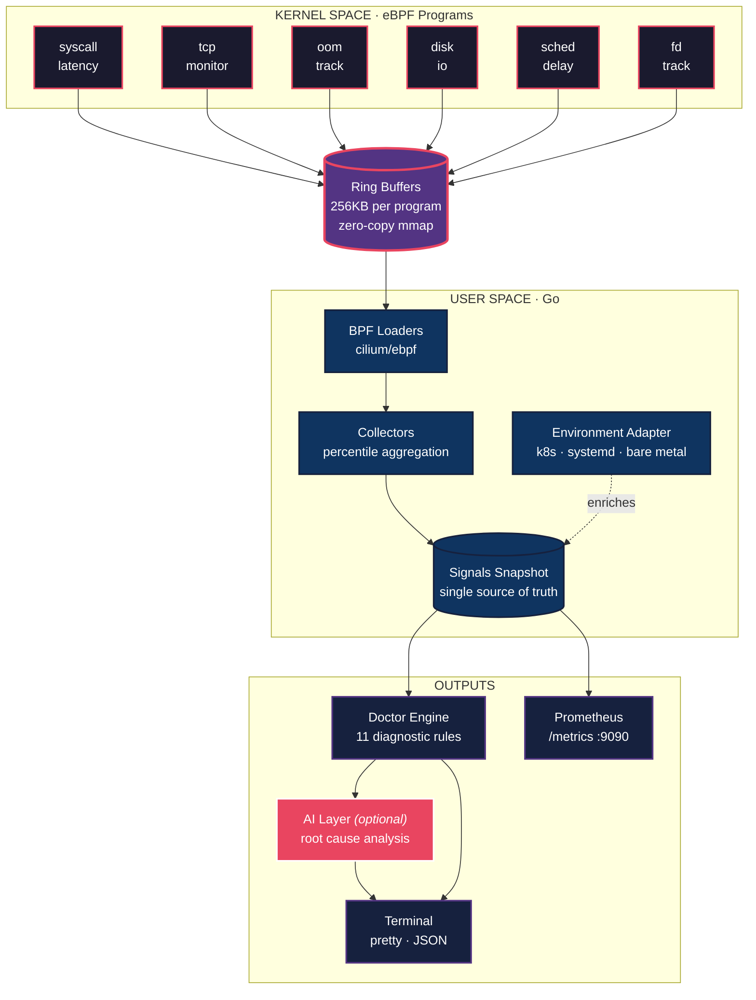

# KERNO 🚀

**The production incident diagnosis engine for Kubernetes**

Your cluster broke. Your dashboards are green. Users are paging.
Run `kerno doctor`. 30 seconds. Root cause. Plain English.

Same single binary runs on bare metal, VMs, EC2, GCE, wherever Linux lives.

[Introduction](#-introduction) · [Features](#-features) · [Setup & Installation](#️-setup--installation) · [Usage & Commands](#-usage--commands) · [Contributing](#-contributing) · [License](#-license)

## 📖 Introduction

Kerno is a Kubernetes-native incident diagnosis engine built on eBPF. It runs as a DaemonSet on every node, watches the kernel instead of your app, and answers a single question on demand: "Why is production broken right now?"

```bash
kubectl -n kerno-system exec ds/kerno -- kerno doctor
```

30 seconds later you get a ranked diagnostic report with plain-English causes, evidence, ETAs, and copy-paste fix steps. No dashboards to wire, no query language to learn, no agents in your app.

The kernel knows minutes before your APM. Hours before your users. Kerno makes that visible.

Same binary outside Kubernetes too. `curl | bash` it onto any bare-metal box, EC2 instance, or systemd VM and `sudo kerno doctor` works exactly the same.

### Why Kerno?

It's 3am. PagerDuty fires. Latency is up, error budget is burning, and every dashboard you own is green. Prometheus says CPU and memory look fine, APM says your app is healthy. That's because every tool you have watches your application. Nothing is watching the kernel.


```mermaid
flowchart TB
    subgraph Stack["YOUR K8S STACK"]
        App["Workload Pods<br/>(Node, Python, Go, Java)"]
        Runtime["Container Runtime<br/>(containerd, CRI-O)"]
        OS["Node Kernel<br/>(Linux)"]
        HW["Nodes / EC2 / GCE"]
    end

    subgraph Tools["WHO WATCHES WHAT"]
        APM["Datadog · New Relic<br/>Prometheus · Grafana"]
        CRun["Pixie · Tetragon<br/>Inspektor Gadget"]
        Kerno["<b>KERNO</b><br/><i>eBPF kernel tracing</i>"]
        Bare["(nobody)"]
    end

    App -.watched by.-> APM
    Runtime -.watched by.-> CRun
    OS -.watched by.-> Kerno
    HW -.watched by.-> Bare

    style Kerno fill:#e94560,stroke:#fff,color:#fff,stroke-width:3px
    style App fill:#0f3460,stroke:#16213e,color:#fff
    style Runtime fill:#16213e,stroke:#533483,color:#fff
    style OS fill:#1a1a2e,stroke:#e94560,color:#fff
    style HW fill:#533483,stroke:#16213e,color:#fff
    style APM fill:#16213e,stroke:#0f3460,color:#ccc
    style CRun fill:#16213e,stroke:#0f3460,color:#ccc
    style Bare fill:#16213e,stroke:#0f3460,color:#888
```

The kernel is where the pain actually lives: disk throttling, TCP retransmits, OOM kills, scheduler contention, FD leaks. Kerno streams kernel signals through eBPF with microsecond overhead and turns them into a diagnostic report that reads like a doctor's note in a single command.

### How Kerno Compares

| Tool | Watches | K8s-Native | Incident Report | SLO Mapping | AI Analysis | Install Time |
|---|---|---|---|---|---|---|
| Prometheus + Grafana | Application | Partial | No | No | No | Hours |
| Datadog APM | Application | Partial | No | Partial | Yes | Hours |
| Cilium Tetragon | Security | Yes | No | No | No | Minutes |
| Inspektor Gadget | Container | Yes | No | No | No | Minutes |
| Pixie | Application | Yes | No | No | No | Minutes |
| **Kerno** | **Kernel** | **Yes** | **Yes** | **Yes** | **Yes** | **< 1 min** |

## ✨ Features

**Incident Diagnosis**
- `kerno doctor`: 30-second cluster-wide diagnostic, ranked findings, fix suggestions
- `kerno explain`: AI-powered kernel error explanation (no root needed)
- `kerno predict`: surface failures before they page you

**Real-Time Tracing**
- `kerno trace syscall`: per-pod syscall latency streaming
- `kerno trace disk`: block I/O latency by device, op, process
- `kerno trace sched`: CPU scheduler run queue delays

**Continuous Monitoring**
- `kerno watch tcp`: TCP connections, RTT, retransmits
- `kerno watch oom`: OOM kill alerts with pod context
- `kerno watch fd`: FD leak detection via growth rate
- `kerno start`: daemon mode with Prometheus metrics

**Integrations**
- Prometheus: 16 metrics at `/metrics`, ServiceMonitor support
- Kubernetes: Helm chart + pod enrichment (no API server load)
- AI Providers: Anthropic, OpenAI, Ollama (optional, opt-in)
- Systemd: unit/slice enrichment on bare metal

## 🛠️ Setup & Installation

> ⚠️ **Prerequisites:** Linux kernel 5.8+ with BTF enabled (Managed K8s like EKS, GKE, AKS, DOKS qualify). Requires cluster-admin privileges for Helm/Manifests.

### 1. Kubernetes Deployment (Recommended)

Within 30 seconds Kerno runs as a DaemonSet on every node, watching the kernel via eBPF.

```bash
helm install kerno ./deploy/helm/kerno \
  -n kerno-system --create-namespace
```

Raw manifests live at `deploy/k8s/` if you don't use Helm.

### 2. Bare Metal / VMs / EC2 / GCE

**Native Package Manager (Production)**

On Debian/Ubuntu:

```bash
curl -LO https://github.com/optiqor/kerno/releases/latest/download/kerno_<version>_amd64.deb
sudo apt install ./kerno_<version>_amd64.deb
```

On RHEL / Fedora / Amazon Linux 2023:

```bash
curl -LO https://github.com/optiqor/kerno/releases/latest/download/kerno-<version>-1.x86_64.rpm
sudo dnf install kerno-<version>-1.x86_64.rpm
```

Once installed, run: `sudo kerno doctor`. To enable persistently as a daemon:

```bash
sudo systemctl enable --now kerno
journalctl -u kerno -f
```

**Quick Shell Installer**

```bash
# Ad-hoc run
curl -sfL https://raw.githubusercontent.com/optiqor/kerno/main/scripts/install.sh | sudo bash
sudo kerno doctor

# Run as a long-lived systemd daemon
curl -sfL https://raw.githubusercontent.com/optiqor/kerno/main/scripts/install.sh | sudo bash -s -- --daemon
```

### 3. Docker (Ad-hoc Testing)

```bash
docker run --rm --privileged --pid=host \
  -v /sys/kernel/debug:/sys/kernel/debug:ro \
  -v /sys/kernel/btf:/sys/kernel/btf:ro \
  -v /sys/fs/bpf:/sys/fs/bpf \
  -v /proc:/proc:ro \
  ghcr.io/optiqor/kerno:latest doctor
```

## 🚀 Usage & Commands

### 🔍 Incident Diagnosis

```bash
# Cluster-wide incident report, 30 seconds of real kernel data
kubectl -n kerno-system exec ds/kerno -- kerno doctor

# Machine-readable JSON output for CI/CD pipelines
kubectl -n kerno-system exec ds/kerno -- kerno doctor --output json --exit-code

# AI-enriched root cause analysis (Requires API Key setup)
kubectl -n kerno-system exec ds/kerno -- kerno doctor --ai
```

### ⏱️ Real-Time Tracing & Watching

```bash
# Every syscall event streaming
kubectl -n kerno-system exec ds/kerno -- kerno trace syscall

# Postgres disk writes over 5ms
kubectl -n kerno-system exec ds/kerno -- kerno trace disk --process postgres --op write --threshold 5ms

# Monitor active OOM kills with Kubernetes pod context
kubectl -n kerno-system exec ds/kerno -- kerno watch oom --alert
```

<details>
<summary>Shell Completions</summary>

**Bash:**

```bash
source <(kerno completion bash)
echo 'source <(kerno completion bash)' >> ~/.bashrc
```

**Zsh:**

```bash
kerno completion zsh > "${fpath[1]}/_kerno"
```

**Fish:**

```bash
kerno completion fish > ~/.config/fish/completions/kerno.fish
```

</details>

<details>
<summary>📊 Prometheus Metrics</summary>

The DaemonSet exposes 16 metrics at `:9090/metrics`. ServiceMonitor support is included out-of-the-box.

| Metric | Type | Description |
|---|---|---|
| `kerno_syscall_duration_nanoseconds` | Summary | Syscall latency (p50, p95, p99) |
| `kerno_syscall_total` | Counter | Total syscall events |
| `kerno_tcp_rtt_nanoseconds` | Summary | TCP round-trip time |
| `kerno_tcp_retransmits_total` | Counter | TCP retransmissions |
| `kerno_oom_kills_total` | Counter | OOM kill events |
| `kerno_disk_io_duration_nanoseconds` | Summary | Disk I/O latency |
| `kerno_sched_delay_nanoseconds` | Summary | CPU run queue delay |
| `kerno_bpf_programs_loaded` | Gauge | Total loaded eBPF programs |

</details>

## 🧠 How It Works & Architecture

Kerno runs as a lightweight Go agent with six tiny eBPF programs attached to stable tracepoints. It collects 30 seconds of real kernel data, evaluates 11 diagnostic rules deterministically, and emits a ranked incident report.


```mermaid
flowchart TB
    subgraph Kernel["KERNEL SPACE · eBPF Programs"]
        direction LR
        P1["syscall<br/>latency"]
        P2["tcp<br/>monitor"]
        P3["oom<br/>track"]
        P4["disk<br/>io"]
        P5["sched<br/>delay"]
        P6["fd<br/>track"]
    end

    RB[("Ring Buffers<br/>256KB per program<br/>zero-copy mmap")]

    subgraph UserSpace["USER SPACE · Go"]
        direction TB
        Loader["BPF Loaders<br/>cilium/ebpf"]
        Collector["Collectors<br/>percentile aggregation"]
        Signals[("Signals Snapshot<br/>single source of truth")]
        Adapter["Environment Adapter<br/>k8s · systemd · bare metal"]
    end

    subgraph Outputs["OUTPUTS"]
        direction TB
        Doctor["Doctor Engine<br/>11 diagnostic rules"]
        AI["AI Layer <i>(optional)</i><br/>root cause analysis"]
        Prom["Prometheus<br/>/metrics :9090"]
        CLI["Terminal<br/>pretty · JSON"]
    end

    P1 & P2 & P3 & P4 & P5 & P6 --> RB
    RB --> Loader
    Loader --> Collector
    Collector --> Signals
    Adapter -.enriches.-> Signals
    Signals --> Doctor
    Signals --> Prom
    Doctor --> AI
    AI --> CLI
    Doctor --> CLI

    classDef kernel fill:#1a1a2e,stroke:#e94560,color:#fff,stroke-width:2px
    classDef user fill:#0f3460,stroke:#16213e,color:#fff,stroke-width:2px
    classDef output fill:#16213e,stroke:#533483,color:#fff,stroke-width:2px
    classDef buffer fill:#533483,stroke:#e94560,color:#fff,stroke-width:3px
    classDef ai fill:#e94560,stroke:#fff,color:#fff,stroke-width:2px

    class P1,P2,P3,P4,P5,P6 kernel
    class Loader,Collector,Signals,Adapter user
    class Doctor,Prom,CLI output
    class RB buffer
    class AI ai
```

### The 11 Diagnostic Rules Evaluated

Kerno runs 11 deterministic rules against every snapshot. Every rule is explainable, configurable, and covered by tests.

| # | Rule | Triggers When | Severity |
|---|---|---|---|
| 1 | Disk I/O Bottleneck | fsync p99 > 50ms or write p99 > 200ms | WARN / CRIT |
| 2 | OOM Kill Occurred | Any OOM event in window | CRIT |
| 3 | TCP Retransmit Storm | Retransmit rate > 2% | CRIT |
| 4 | TCP RTT Degradation | RTT p99 > 10ms | WARN |
| 5 | Scheduler Contention | Runqueue delay p99 > 5ms | WARN / CRIT |
| 6 | FD Leak | FD growth > 10/sec sustained | WARN (with ETA) |
| 7 | Syscall Latency High | Any syscall p99 > 100ms | WARN / CRIT |
| 8 | OOM Imminent | Memory > 90% + positive growth | WARN / CRIT (with ETA) |
| 9 | Syscall Error Rate | Error rate > 1% per syscall | WARN / CRIT |
| 10 | Memory Pressure | RSS usage > 90% | WARN |
| 11 | Network Latency | Connection RTT > 100ms | WARN |

## 🛠️ Building & Testing from Source

```bash
make build         # Build binary (uses BPF stubs, no clang needed)
make generate       # Run bpf2go to produce *_bpfel.go from C sources
make bpf           # Compile eBPF C programs to .o
make test          # Run unit tests
make verify        # Comprehensive 13-phase production-readiness check
```

**Inducing Chaos Scenarios (Testing Rules)**

```bash
# Induce an artificial incident to check if rule fires
kerno chaos --induce fd-leak --intensity high --duration 30s
# In another shell, run 'sudo kerno doctor' to catch it.
```

## 🤝 Contributing

Contributions are welcome! Please read [CONTRIBUTING.md](./CONTRIBUTING.md) for details on our development environment setup, Conventional Commits guidelines, and code review processes.

## 📄 License

This project is licensed under the Apache License 2.0, see the [LICENSE](./LICENSE) file for details.

If Kerno saved your on-call shift, consider leaving a ⭐. It helps other engineers find the project!