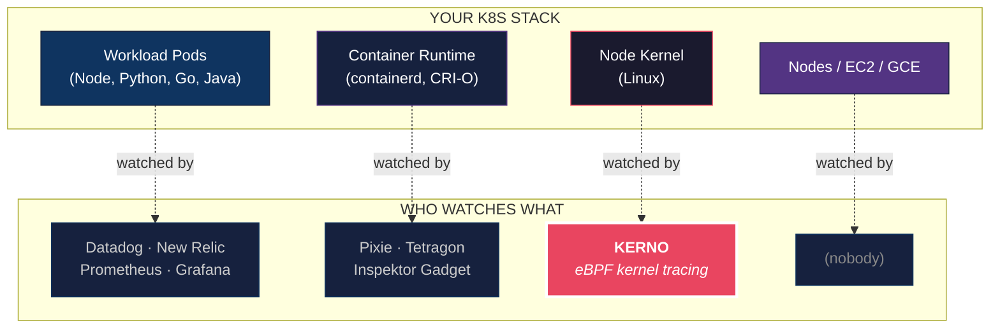

**Here is your improved README** with a new **Troubleshooting** section added:

```markdown
<div align="center">

# KERNO

### The production incident diagnosis engine for Kubernetes

**Your cluster broke. Your dashboards are green. Users are paging.**
**Run `kerno doctor`. 30 seconds. Root cause. Plain English.**

<sub>Same single binary runs on bare metal, VMs, EC2, GCE - wherever Linux lives.</sub>

[](https://github.com/optiqor/kerno/actions/workflows/ci.yml)
[](https://goreportcard.com/report/github.com/optiqor/kerno)
[](LICENSE)
[](https://github.com/optiqor/kerno/releases)
[](https://github.com/optiqor/kerno/pkgs/container/kerno)


[**Quick Start**](#quick-start) · [**How It Works**](#how-it-works) · [**Features**](#features) · [**Kubernetes**](#kubernetes-deployment) · [**Docs**](docs/architecture.md)


</div>

---
## Contributing

We welcome contributions! Whether it's fixing a bug, improving documentation, adding a diagnostic rule, or working on eBPF — every contribution helps.

See [CONTRIBUTING.md](CONTRIBUTING.md) to get started.

## What is Kerno?

Kerno is a **Kubernetes-native incident diagnosis engine** built on eBPF.
It runs as a DaemonSet on every node, watches the kernel - not your app - and answers a single question on demand:

> *Why is production broken right now?*

```bash
kubectl -n kerno-system exec ds/kerno -- kerno doctor
```

30 seconds later you get a ranked diagnostic report with **plain-English causes, evidence, ETAs, and copy-paste fix steps** - no dashboards to wire, no query language to learn, no agents in your app.

The kernel knows minutes before your APM. Hours before your users. Kerno makes that visible.

**Same binary outside Kubernetes too.** `curl | bash` it onto any bare-metal box, EC2 instance, or systemd VM and `sudo kerno doctor` works exactly the same.

## Why Kerno?

It's 3am. PagerDuty fires. Latency is up, error budget is burning, and every dashboard you own is **green**.

- Prometheus says CPU and memory look fine.
- Datadog APM says your app is healthy.
- The Grafana panels your SRE spent a weekend building - all green.

**That's because every tool you have watches your _application_. Nothing is watching the kernel.**


```mermaid
flowchart TB
    subgraph Stack["YOUR K8S STACK"]
        App["Workload Pods<br/>(Node, Python, Go, Java)"]
        Runtime["Container Runtime<br/>(containerd, CRI-O)"]
        OS["Node Kernel<br/>(Linux)"]
        HW["Nodes / EC2 / GCE"]
    end

    subgraph Tools["WHO WATCHES WHAT"]
        APM["Datadog · New Relic<br/>Prometheus · Grafana"]
        CRun["Pixie · Tetragon<br/>Inspektor Gadget"]
        Kerno["<b>KERNO</b><br/><i>eBPF kernel tracing</i>"]
        Bare["(nobody)"]
    end

    App -.watched by.-> APM
    Runtime -.watched by.-> CRun
    OS -.watched by.-> Kerno
    HW -.watched by.-> Bare

    style Kerno fill:#e94560,stroke:#fff,color:#fff,stroke-width:3px
    style App fill:#0f3460,stroke:#16213e,color:#fff
    style Runtime fill:#16213e,stroke:#533483,color:#fff
    style OS fill:#1a1a2e,stroke:#e94560,color:#fff
    style HW fill:#533483,stroke:#16213e,color:#fff
    style APM fill:#16213e,stroke:#0f3460,color:#ccc
    style CRun fill:#16213e,stroke:#0f3460,color:#ccc
    style Bare fill:#16213e,stroke:#0f3460,color:#888
```

The kernel is where the pain actually lives - disk throttling, TCP retransmits, OOM kills, scheduler contention, FD leaks. The kernel knows minutes before your dashboards. Hours before your users.

Kerno runs as a DaemonSet on every node, streams kernel signals through eBPF with microsecond overhead, and turns them into a diagnostic report that reads like a doctor's note.

```bash
kubectl -n kerno-system exec ds/kerno -- kerno doctor
```

One command. 30 seconds later, you get the report shown in the [demo above](#kerno) - ranked findings, plain-English causes, evidence, and copy-paste fix steps.

That's the entire debugging loop - from page to root cause - in a single command.

---

## How Kerno compares

| Tool                    | Watches     | K8s-Native | Incident Report | Root Cause Analysis | AI Analysis | Install Time |
|-------------------------|-------------|------------|-----------------|---------------------|-------------|--------------|
| Prometheus + Grafana    | Application | Partial    | No              | No                  | No          | Hours        |
| Datadog APM             | Application | Partial    | No              | Partial             | Yes         | Hours        |
| Cilium Tetragon         | Security    | Yes        | No              | No                  | No          | Minutes      |
| Inspektor Gadget        | Container   | Yes        | No              | No                  | No          | Minutes      |
| Pixie                   | Application | Yes        | No              | No                  | No          | Minutes      |
| **Kerno**               | **Kernel**  | **Yes**    | **Yes**         | **Yes**             | **Yes**     | **< 1 min**  |

**Kerno is the only eBPF tool** in the Kubernetes ecosystem that produces a **ranked, human-readable incident report** — not just raw events or another dashboard.

---

## Quick Start

> **Requires:** kernel **5.8+** with BTF (every major managed K8s qualifies: EKS, GKE, AKS, DOKS, Linode, Civo).

### 1. Kubernetes (Recommended)

```bash
helm install kerno ./deploy/helm/kerno \
  -n kerno-system --create-namespace
```

```bash
# Cluster-wide incident report (30 seconds)
kubectl -n kerno-system exec ds/kerno -- kerno doctor

# JSON output for CI/CD
kubectl -n kerno-system exec ds/kerno -- kerno doctor --output json --exit-code

# With AI analysis
kubectl -n kerno-system exec ds/kerno -- kerno doctor --ai
```

### 2. Bare Metal / VMs / EC2 / GCE

```bash
curl -sfL https://raw.githubusercontent.com/optiqor/kerno/main/scripts/install.sh | sudo bash
sudo kerno doctor
```

---

## Troubleshooting

### eBPF program fails to load

**Error:** `failed to load BPF program` or `permission denied`

**Solutions:**
- Make sure your kernel is **5.8+** and has **BTF** enabled
- Run with proper capabilities (Kerno already uses minimum required)
- On some systems you may need:

```bash
sudo sysctl -w kernel.unprivileged_bpf_disabled=0
```

### `kerno doctor` shows no output / empty report

**Possible causes:**
- eBPF programs failed to load silently
- Very short collection window

**Fix:**
```bash
kubectl -n kerno-system logs -l app.kubernetes.io/name=kerno
kubectl -n kerno-system exec ds/kerno -- kerno doctor --duration 30s
```

### Prometheus metrics not appearing

**Check:**
```bash
kubectl -n kerno-system port-forward ds/kerno 9090:9090
curl http://localhost:9090/metrics
```

Make sure `serviceMonitor.enabled: true` in Helm values if using Prometheus Operator.

### AI features not working

**Error:** `AI analysis failed` or empty AI output

**Fix:**
```bash
kubectl -n kerno-system set env ds/kerno \
  KERNO_AI_PROVIDER=anthropic \
  KERNO_AI_API_KEY=sk-...
```

Currently supported providers: `anthropic`, `openai`, `ollama`.

### Running on unsupported kernel

Kerno gracefully degrades. If some eBPF programs fail to load, those collectors are skipped. You will see warnings in the logs:

```bash
kubectl -n kerno-system logs -l app.kubernetes.io/name=kerno | grep -i bpf
```

### Permission issues on bare metal

Make sure you run with `sudo`:

```bash
sudo kerno doctor
```

Or run the systemd service (recommended for production):

```bash
curl -sfL https://raw.githubusercontent.com/optiqor/kerno/main/scripts/install.sh | sudo bash -s -- --daemon
```

---

## Features

<table>
<tr>
<td width="50%" valign="top">

### Incident Diagnosis

- **`kerno doctor`** — 30-second cluster-wide diagnostic report
- **`kerno explain`** — AI-powered kernel error explanation
- **`kerno predict`** — Predict failures before they happen

### Real-Time Tracing

- **`kerno trace syscall`** — Per-pod syscall latency
- **`kerno trace disk`** — Block I/O latency
- **`kerno trace sched`** — CPU scheduler delays

</td>
<td width="50%" valign="top">

### Continuous Monitoring

- **`kerno watch tcp`** — TCP retransmits & RTT
- **`kerno watch oom`** — OOM kill alerts
- **`kerno watch fd`** — File descriptor leak detection
- **`kerno start`** — Run as daemon with Prometheus metrics

### Integrations

- **Prometheus** + **ServiceMonitor**
- **Kubernetes** (Helm + pod enrichment)
- **AI Providers** (Anthropic, OpenAI, Ollama)
- **Systemd** enrichment on bare metal

</td>
</tr>
</table>

---

## How It Works

Kerno uses **6 lightweight eBPF programs** to collect kernel data with almost zero overhead. When you run `kerno doctor`, it collects 30 seconds of real data, runs 11 deterministic diagnostic rules, and produces a human-readable report.

AI is **optional** and only used for root cause explanation — it never replaces the core rule engine.

---

## Usage

```bash
# Main diagnostic command
kubectl -n kerno-system exec ds/kerno -- kerno doctor

# With AI analysis
kubectl -n kerno-system exec ds/kerno -- kerno doctor --ai

# Real-time tracing
kubectl -n kerno-system exec ds/kerno -- kerno trace syscall
```

---

## Building from Source

```bash
make build
make verify          # Full production readiness check
make docker
```

---

## Contributing

See [CONTRIBUTING.md](CONTRIBUTING.md) for development setup, commit conventions, and review process.

For security issues, see [SECURITY.md](SECURITY.md).

---

## License

Apache License 2.0 — see [LICENSE](LICENSE).

<div align="center">

---

If Kerno helped you during an incident, consider giving it a **⭐**. It helps others discover the project.

</div>